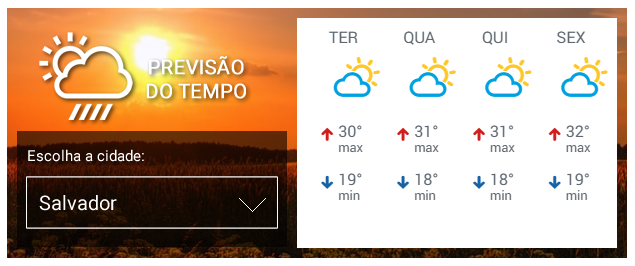

# Desafio Estagio Front-end da Convergence Works

Você gosta de UX e arquitetura de informação? Gosta de novas tecnologias e de desafios? Tem espírito de equipe e é comprometido? Você gostaria de colocar tudo isto em prática em uma empresa?

## Quem somos?
Somos a Convergence Works, somos a convergência entre os desafios das empresas e as ideias pra vencê-los. Desenvolvemos plataformas para o mundo digital, com foco em comunicação. Somos especialistas na criação de sites e aplicativos para plataformas de comunicação. Integramos sistema de gestão de conteúdo, aplicativo, disparo de email, solução para clube de assinantes, implantação de editoriais em múltiplas plataformas.

## A Vaga
Para se candidatar:  

- Conhecimento básico das tecnologias fundamentais da web (HTML, CSS, JavaScript e jQuery);
- Noções de UX e arquitetura de informação
- Capacidade de comunicação, comprometimento e vontade de pôr a mão na massa;
- Capacidade de aprender rapidamente tecnologias emergentes.

Benefícios
- Excelente ambiente de trabalho 
- Oportunidade de crescimento e contratação
- Bolsa de R$ 1.000

## O Desafio
Para avaliar seu desempenho com Front-end temos um desafio para você.

Desenvolver um componente de clima de acordo com o layout abaixo, onde o usuário deve ser capaz escolher a cidade.

### Layout

Você tem liberdade de desenvolve-lo como bem entender.

## Critérios de Avaliação

- Organização
- Semântica
- Decisões Técnicas
- Ferramentas Utilizadas

## Tecnologias que utilizamos na Convergence Works
- Preprocessador [Less](http://lesscss.org) e CSS
- Task Runner: [Gulp](https://gulpjs.com)
- JavaScript e [jQuery](http://jquery.com)
- [Twig](https://twig.symfony.com/)
